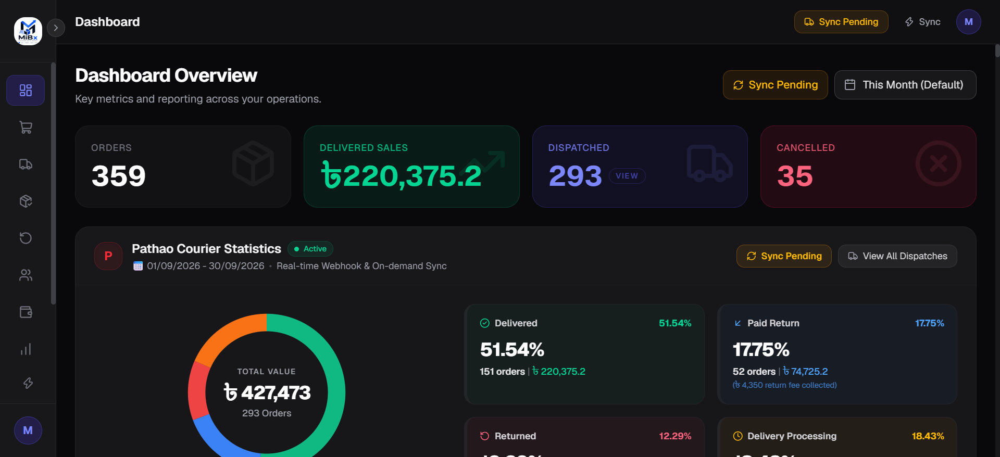
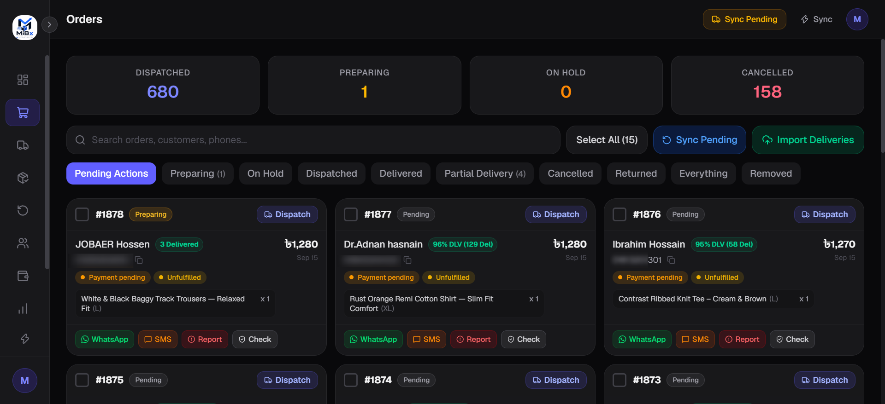
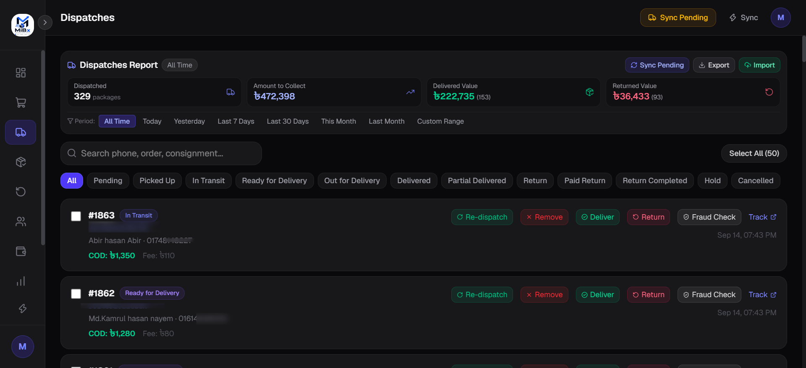
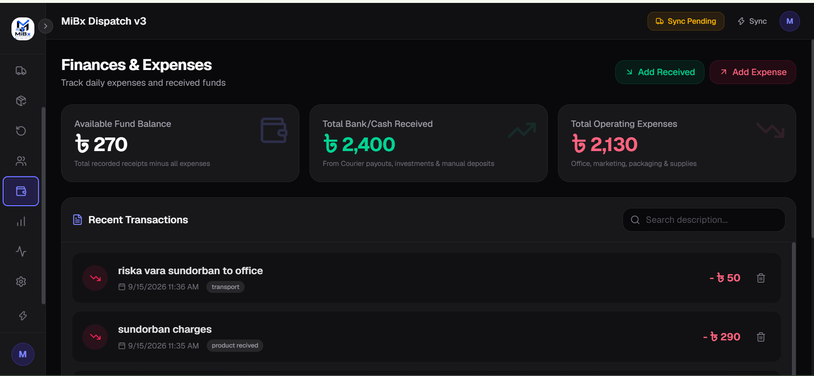
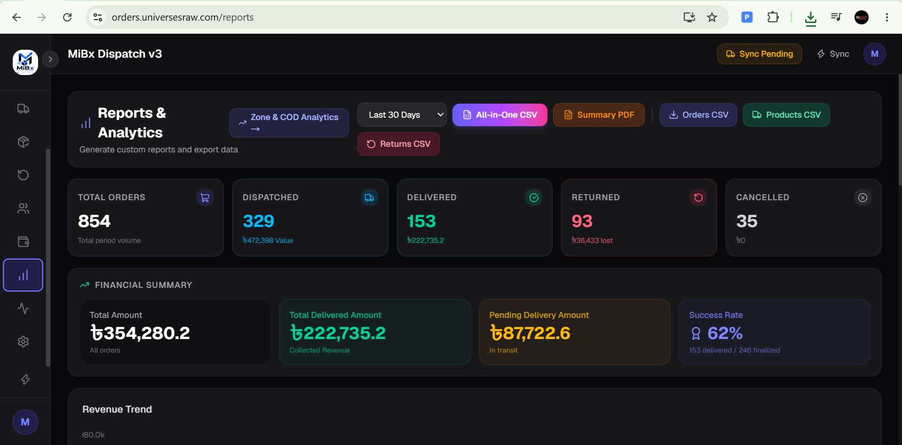
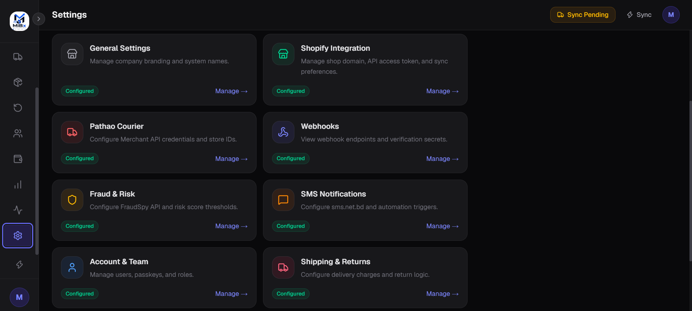
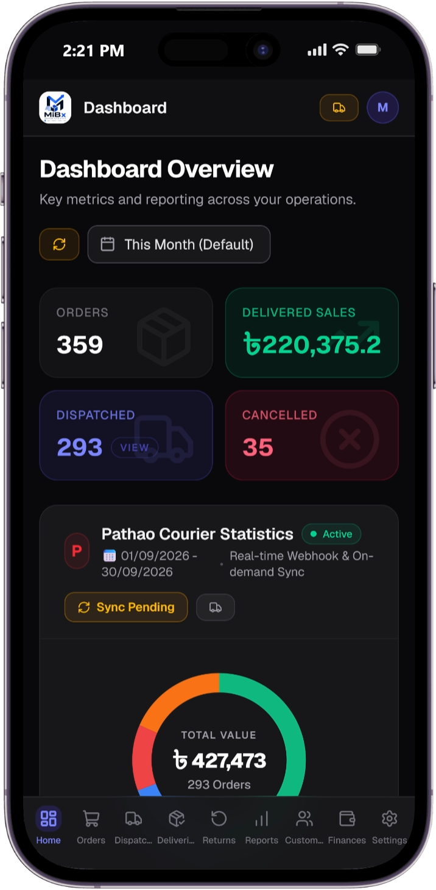
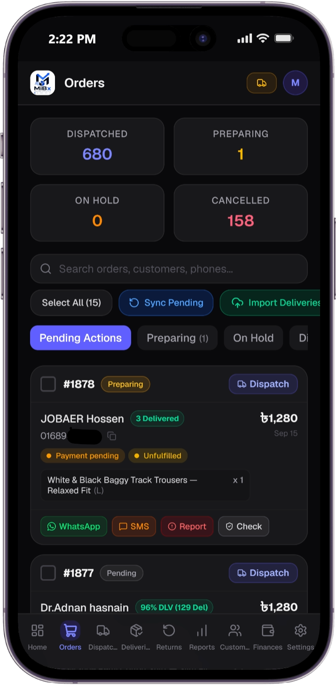
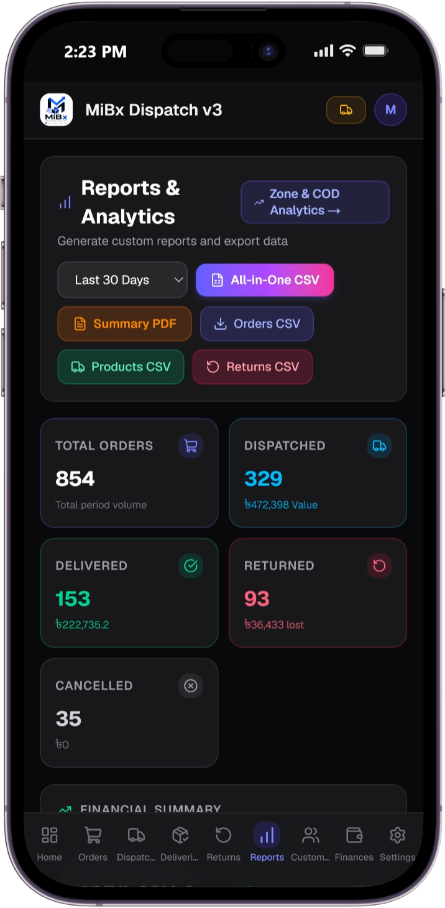
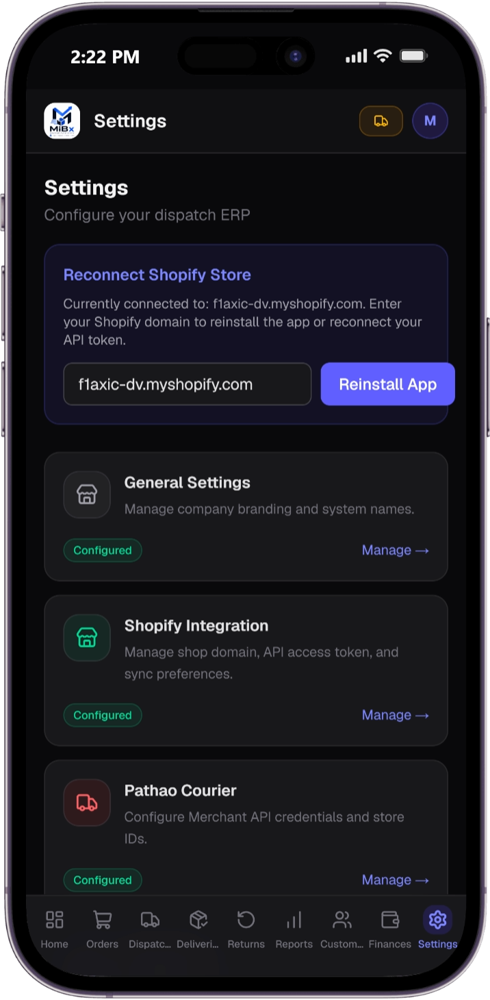

<div align="center">
  <h1>🚀 MiBx Dispatch</h1>
  <p>
    <strong>AI-Powered Order & Courier Operations System for Modern E-Commerce</strong>
  </p>
  <p>
    <a href="https://nextjs.org/"></a>
    <a href="https://supabase.com/"></a>
    <a href="https://tailwindcss.com/"></a>
    <a href="https://www.typescriptlang.org/"></a>
  </p>
</div>

<hr />

## 📖 Overview

**MiBx Dispatch** is a bespoke, single-tenant ERP and logistics middleware built for Shopify. It acts as the central brain between a Shopify storefront and third-party logistics providers, automating order ingestion, fraud detection, courier dispatching, bidirectional status syncing, and customer SMS notifications.

---

## 📸 Application Showcase

MiBx Dispatch features a truly responsive, dual-interface design. The expansive Desktop UI provides deep data analytics and bulk actions, while the Mobile-First UI allows warehouse operators to manage shipments directly from the floor with one-handed workflows.

### 💻 The Desktop Experience

| 📊 **Dashboard & Analytics** | 📦 **Orders & Dispatching** |
| :---: | :---: |
|  <br> *Real-time KPIs, Revenue, and Fulfillment stats.* |  <br> *Advanced order filtering, fraud scoring, and one-click dispatch.* |

| 🚚 **Dispatches & Returns** | 💰 **Finances & Reconciliation** |
| :---: | :---: |
|  <br> *Live courier tracking and return management.* |  <br> *Cashflow tracking and automated courier reconciliation.* |

| 📈 **Custom Reporting** | ⚙️ **Settings & Configurations** |
| :---: | :---: |
|  <br> *Generate and export detailed CSV & PDF reports.* |  <br> *Manage integrations, webhooks, and SMS rules.* |

### 📱 The Mobile-First Experience (Warehouse Ready)

Warehouse floors don't operate from desktop browsers. MiBx Dispatch is explicitly designed with a **Mobile-First UX/UI** to empower operators exactly where they work, featuring PWA-readiness and thumb-friendly bottom navigation.

<div align="center">
  <table>
    <tr>
      <td align="center"><b>Mobile Dashboard</b></td>
      <td align="center"><b>Mobile Orders</b></td>
      <td align="center"><b>Mobile Reports</b></td>
      <td align="center"><b>Mobile Settings</b></td>
    </tr>
    <tr>
      <td></td>
      <td></td>
      <td></td>
      <td></td>
    </tr>
  </table>
</div>

---

## ⚙️ How It Works (The Workflow)

1. **Ingestion & Verification:** A customer places an order on Shopify. MiBx Dispatch instantly catches the webhook, verifying the payload cryptographically.
2. **AI-Powered Fraud Check:** The system automatically checks the customer's phone number and history against the **FraudSpy API**. It scores the risk of the order and automatically tags it in Shopify (e.g., `Fraud: Safe`, `Fraud: High`).
3. **Operational Review:** The order drops into the MiBx dashboard. High-risk orders are placed "On Hold", while safe orders are queued for dispatch.
4. **Bulk Dispatching:** Warehouse staff select hundreds of eligible orders and hit "Dispatch". The system connects to the **Pathao Courier API**, generates waybills, and confirms the dispatches—processing 1,000+ orders in seconds.
5. **Customer Engagement:** As the courier moves the package, MiBx Dispatch triggers automated, localized SMS updates to the customer (e.g., "Out for Delivery", "Delivered").
6. **Reconciliation & Reporting:** Real-time dashboards update automatically. Financials, collected COD amounts, return fees, and operational success rates are reconciled instantly.

---

## 🎯 Problems & Solutions

**🔴 Problem:** Day-to-day order dispatch required repetitive manual entry and processing of approximately 50–100 orders daily, consuming significant operational time and creating opportunities for human error.  
**🟢 Solution:** Built a custom Shopify–courier dispatch system that enables **one-click bulk dispatch**, allowing hundreds of orders to be processed simultaneously and supporting the dispatch of **1,000+ orders within seconds** through automated workflows.

**🔴 Problem:** Month-end sales reporting and performance tracking required manual data collection and reporting, making it difficult to monitor daily business performance.  
**🟢 Solution:** Built automated **daily and monthly sales reporting** with live KPI visibility, allowing management to monitor sales performance, order activity, revenue, and operational metrics without manually preparing reports.

**🔴 Problem:** Delivery and return management involved significant manual work, including checking statuses and manually updating orders.  
**🟢 Solution:** Integrated **Shopify and Pathao webhooks** to automate delivery and return status synchronization. Orders can automatically be updated based on courier events, significantly reducing manual status management.

**🔴 Problem:** Customer SMS communication for dispatch, delivery, and other order updates was handled manually, consuming time and creating the risk of incorrect contact information or missed communication.  
**🟢 Solution:** Built an **automated SMS communication system** connected to order-status workflows, supporting automatic customer notifications for dispatch and delivery events as well as custom SMS messages when required.

**🔴 Problem:** Customer background checks and COD fraud detection required manual investigation before processing orders.  
**🟢 Solution:** Built an **automated customer verification and fraud-checking workflow** that evaluates customer history and automatically adds relevant risk information, delivery history, return history, and order details to Shopify and the dispatch system. Orders can be tagged based on the resulting assessment for faster operational decisions.

---

## 📈 Overall Impact

- Solved **15+ operational problems** within a single integrated system.
- Reduced manual/analog operational workload by approximately **45%** through automation.
- Automated repetitive order, dispatch, delivery, return, reporting, customer communication, and fraud-checking workflows.
- Supports high-volume order processing and significantly reduces repetitive manual work.
- Connected **Shopify, courier APIs/webhooks, customer data, reporting, SMS communication, and fraud detection** into one operational workflow.
- Designed around real day-to-day business problems, with solutions developed and implemented based on actual operational requirements.

---

## 🔒 Security & Architecture

Security is baked into the foundation of MiBx Dispatch to protect sensitive merchant and customer data.

- **Supabase Row-Level Security (RLS):** Database access is heavily restricted at the Postgres engine level. Authenticated users can only read or mutate rows that belong to their explicitly authorized tenant/organization.
- **Next.js Server Actions:** Sensitive operations (like generating courier API tokens, evaluating fraud rules, and triggering SMS) are strictly confined to the server. API keys are never exposed to the client bundle.
- **Cryptographic Webhook Verification:** 
  - **Shopify:** All incoming payloads are verified using HMAC-SHA256 signatures ensuring they originated exclusively from Shopify.
  - **Pathao/Couriers:** Incoming status updates are validated using custom integration secrets.
- **Secure Key Management:** Database migrations, cron jobs, and background workers operate using scoped Service Role Keys that bypass RLS, safely stored in environment variables and never committed to source control.

---

## 🛠️ Technology Stack

| Category | Technology | Description |
| :--- | :--- | :--- |
| **Frontend Framework** | [Next.js (App Router)](https://nextjs.org) | React 19 framework utilizing Server Components for performance and security. |
| **Database & Auth** | [Supabase](https://supabase.com) | Enterprise-grade PostgreSQL database with integrated Authentication and RLS. |
| **Styling & UI** | [Tailwind CSS v4](https://tailwindcss.com) | Utility-first CSS combined with [shadcn/ui](https://ui.shadcn.com) for accessible, premium components. |
| **Message Queue** | [Upstash QStash](https://upstash.com) | Serverless HTTP-based messaging and scheduling for reliable background jobs. |
| **Caching** | [Upstash Redis](https://upstash.com) | Low-latency data store for rate-limiting, session caching, and heavy query optimization. |

---

## 🚀 Getting Started

Follow these instructions to set up the project locally for development or production deployment.

### 1. Prerequisites
- **Node.js** (v18 or higher)
- **Supabase Project** (Database, Auth, and Storage)
- **Upstash Account** (Redis & QStash)
- **Shopify Partner Account** (Custom App credentials and configured webhooks)
- **Courier API Credentials** (e.g., Pathao Merchant Account)

### 2. Installation

Clone the repository and install the dependencies:

```bash
git clone https://github.com/your-username/mibx-dispatch.git
cd mibx-dispatch
npm install
```

### 3. Environment Configuration

Copy the example environment file:
```bash
cp .env.example .env
```
Ensure you carefully populate the following required variables:
- **`NEXT_PUBLIC_SUPABASE_URL`** / **`NEXT_PUBLIC_SUPABASE_ANON_KEY`**
- **`SUPABASE_SERVICE_ROLE_KEY`** (Keep this strictly secret!)
- **`QSTASH_TOKEN`** / **`QSTASH_CURRENT_SIGNING_KEY`**
- **`SHOPIFY_API_KEY`** / **`SHOPIFY_API_SECRET`**
- **`PATHAO_CLIENT_ID`** / **`PATHAO_CLIENT_SECRET`** (or respective courier keys)

### 4. Database Initialization

Run the included Supabase migrations to provision your schemas, tables, views, and RLS policies:
```bash
# Using the Supabase CLI
supabase link --project-ref your-project-ref
supabase db push
```

### 5. Start the Development Server

```bash
npm run dev
```
Navigate to [http://localhost:3000](http://localhost:3000) to access the application.

---

## ☁️ Deployment Guide

MiBx Dispatch is architected for edge-ready deployment on [Vercel](https://vercel.com/). 

1. **Connect Repository:** Import the GitHub repository into your Vercel dashboard.
2. **Environment Variables:** Ensure *all* variables from your `.env` are mirrored in Vercel's environment settings.
3. **Cron Jobs:** The system utilizes standard API routes for periodic tasks (e.g., `api/cron/courier-sync`). Ensure your deployment platform or a service like cron-job.org is pinging these endpoints securely.
4. **Deploy:** Trigger the build and deploy.

---

<div align="center">
  <p>Architected for scale. Built for modern e-commerce.</p>
</div>
